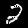
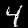

# My Deep Convolutional Generative Adversarial Network

This repo contains a Pytorch implementation of [Deep Convolutional Generative Adversarial Network](https://arxiv.org/abs/1511.06434) (DCGAN), trained using Wasserstein Loss with Gradient Penalty. When used as a CLI, it supports training on one of the following datasets:
* MNIST
* CelebA
Repo can also be used as a package. The implementation supports training on GPU.

## Installation
There are two ways of using this package:
* Running the training on one of the datasets in the terminal
* Importing the package as a library

To download the code, run:
```shell
git clone https://github.com/aleksac99/MyDCGAN
```

To install the library, run:
```shell
pip install .
```

### Use without installation

Alternatively, you can run the code without installation. In that case you need to install dependencies manually:
```shell
pip install -r requirements.txt
```

## How to use

### Configuration
Before training, please change parameters in `config.json` to your preference. You can create several config files as long as you define all parameters listed in the reference config file.

### Run training from terminal
To start the training on one of the supported datasets, run:
```shell
my-dcgan <CONFIG_FILE>
```
where `<CONFIG_FILE>` is the required path to your config file.

### Run without installation
To start training without installing a package, run the package with the command:
```shell
python -m my_dcgan <CONFIG_FILE>
```

### Using the package as a library
You can use the defined models, loss and trainer in your custom scripts. The code below shows how to import the required classes:
```python
from my_dcgan.model.model import DCGANDiscriminator, DCGANGenerator
from my_dcgan.model.loss import WassersteinGPLoss, GeneratorLoss
from my_dcgan.trainer.trainer import Trainer
```
Please refer to class docstrings in order to see how to use these classes.

## Results

Here are some images produced by Generator trained on MNIST dataset:







